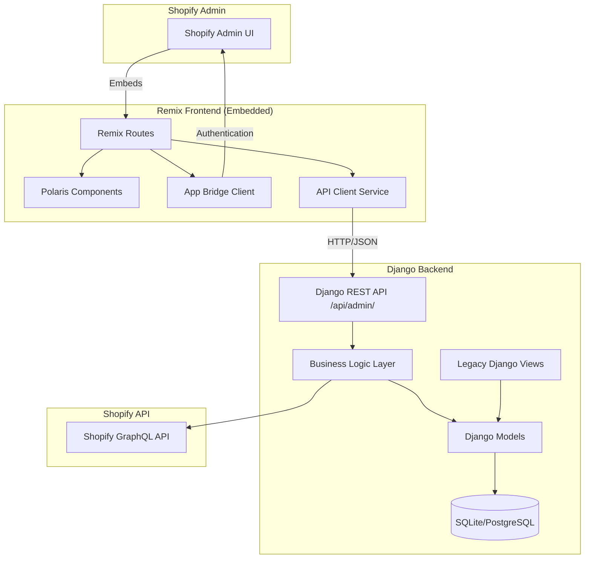

# Design Document: Shopify Polaris UI Migration

## Overview

This design document specifies the architecture and implementation approach for migrating the Django Shop Manager UI to a Shopify Polaris Embedded App. The solution creates a second UI layer that coexists with the existing Django templates, providing a native Shopify Admin experience while maintaining all existing backend functionality unchanged.

The architecture follows a clear separation of concerns:
- **Backend API Layer**: Django REST Framework endpoints providing render-ready data
- **Frontend UI Layer**: Remix + React + Polaris components for embedded views
- **Integration Layer**: App Bridge for Shopify Admin integration and session management

### Key Design Principles

1. **No Backend Logic Duplication**: All business logic remains in existing Django models and services
2. **Polaris-Only UI**: Exclusively use Shopify Polaris components for visual consistency
3. **Coexistence**: Both UIs operate independently without interference
4. **Render-Ready Data**: API endpoints return UI-oriented data, not raw CRUD
5. **Type Safety**: TypeScript for frontend code
6. **Testability**: Clear boundaries for unit and property-based testing

## Architecture

### System Architecture Diagram



### Request Flow

1. **User accesses embedded app** → Shopify Admin loads Remix app in iframe
2. **App Bridge authenticates** → Session token validated
3. **Remix loader fetches data** → Calls Django REST API with session token
4. **Django validates token** → Checks session and permissions
5. **Django returns render-ready data** → Serialized for UI consumption
6. **Polaris components render** → Display data using Shopify design system
7. **User actions** → Remix actions call Django API endpoints
8. **Django executes business logic** → Uses existing models and services
9. **Response returned** → UI updates with Toast notifications

### Technology Stack

**Frontend:**
- Remix 2.16+ (React framework with server-side rendering)
- React 18.2+ (UI library)
- Shopify Polaris 12.0+ (Design system and components)
- Shopify App Bridge 4.1+ (Embedded app integration)
- TypeScript 5.2+ (Type safety)
- Vite 6.2+ (Build tool)

**Backend:**
- Django 4.x+ (Existing backend framework)
- Django REST Framework 3.14+ (API layer)
- Python 3.10+ (Programming language)

**Integration:**
- Shopify Admin GraphQL API (January 2025 version)
- JWT Session Tokens (Authentication)
- Prisma (Session storage for Remix)


## Components and Interfaces

### Backend API Layer

#### Django REST Framework Structure

```
shop_manager/
├── api/                          # New Django app for API
│   ├── __init__.py
│   ├── apps.py
│   ├── urls.py                   # API URL routing
│   ├── authentication.py         # Session token validation
│   ├── permissions.py            # Permission classes
│   ├── serializers/              # DRF Serializers
│   │   ├── __init__.py
│   │   ├── products.py           # Product serializers
│   │   ├── inventory.py          # Inventory serializers
│   │   ├── orders.py             # Order serializers
│   │   └── jobs.py               # Job serializers
│   └── views/                    # DRF ViewSets
│       ├── __init__.py
│       ├── context.py            # Context/session view
│       ├── products.py           # Product views
│       ├── inventory.py          # Inventory views
│       ├── orders.py             # Order views
│       └── jobs.py               # Job views
```

#### API Endpoints Specification

**Context Endpoint:**
```
GET /api/admin/context/
Response: {
  "shop": {
    "myshopify_domain": "example.myshopify.com",
    "name": "Example Shop",
    "domain": "example.com",
    "currency": "USD"
  },
  "user": {
    "id": 1,
    "username": "admin",
    "email": "admin@example.com"
  },
  "permissions": {
    "can_sync_products": true,
    "can_manage_inventory": true,
    "can_view_orders": true
  }
}
```

**Products Endpoints:**
```
GET /api/admin/products/
Query params: page, page_size, title, vendor, product_type, tags, ordering
Response: {
  "count": 100,
  "next": "/api/admin/products/?page=2",
  "previous": null,
  "results": [
    {
      "id": 1,
      "title": "Product Name",
      "vendor": "Vendor Name",
      "product_type": "Type",
      "tags": "tag1, tag2",
      "variant_count": 3,
      "sync_status": "synced|pending|error",
      "last_synced_at": "2025-01-15T10:30:00Z",
      "created_at": "2025-01-01T00:00:00Z"
    }
  ]
}

GET /api/admin/products/{id}/
Response: {
  "id": 1,
  "shopify_id": "gid://shopify/Product/123",
  "title": "Product Name",
  "description": "Product description",
  "vendor": "Vendor Name",
  "product_type": "Type",
  "tags": "tag1, tag2",
  "handle": "product-name",
  "images": [
    {
      "id": 1,
      "src": "https://cdn.shopify.com/...",
      "position": 1
    }
  ],
  "variants": [
    {
      "id": 1,
      "shopify_id": "gid://shopify/ProductVariant/456",
      "title": "Default",
      "sku": "SKU123",
      "price": "99.99",
      "compare_at_price": "129.99",
      "barcode": "123456789",
      "inventory_quantity": 10,
      "inventory_policy": "deny",
      "option1": "Size",
      "option2": "Color",
      "option3": null
    }
  ],
  "sync_status": "synced",
  "last_synced_at": "2025-01-15T10:30:00Z"
}

POST /api/admin/products/{id}/sync/
Response: {
  "success": true,
  "message": "Product synchronized successfully",
  "synced_at": "2025-01-15T10:35:00Z"
}

POST /api/admin/products/bulk-sync/
Body: {
  "product_ids": [1, 2, 3]
}
Response: {
  "success_count": 2,
  "error_count": 1,
  "results": [
    {"id": 1, "success": true},
    {"id": 2, "success": true},
    {"id": 3, "success": false, "error": "Error message"}
  ]
}
```


**Inventory Endpoints:**
```
GET /api/admin/inventory/
Query params: page, page_size, product_title, sku
Response: {
  "count": 50,
  "next": "/api/admin/inventory/?page=2",
  "previous": null,
  "results": [
    {
      "id": 1,
      "product_title": "Product Name",
      "variant_title": "Size: M",
      "sku": "SKU123",
      "source_quantity": 10,
      "tracked": true,
      "sync_pending": false,
      "last_synced_at": "2025-01-15T10:30:00Z"
    }
  ]
}

POST /api/admin/inventory/reconcile/
Response: {
  "success": true,
  "reconciled_count": 45,
  "message": "Inventory reconciled successfully"
}
```

**Jobs Endpoints:**
```
GET /api/admin/jobs/
Query params: page, page_size, status, job_type
Response: {
  "count": 20,
  "results": [
    {
      "id": 1,
      "job_type": "product_sync",
      "status": "running|completed|failed|pending",
      "progress": 75,
      "started_at": "2025-01-15T10:00:00Z",
      "completed_at": null,
      "error_message": null
    }
  ]
}

GET /api/admin/jobs/{id}/
Response: {
  "id": 1,
  "job_type": "product_sync",
  "status": "completed",
  "progress": 100,
  "started_at": "2025-01-15T10:00:00Z",
  "completed_at": "2025-01-15T10:05:00Z",
  "logs": [
    {"timestamp": "2025-01-15T10:00:00Z", "message": "Job started"},
    {"timestamp": "2025-01-15T10:05:00Z", "message": "Job completed"}
  ]
}
```

#### Authentication Middleware

```python
# api/authentication.py
from rest_framework.authentication import BaseAuthentication
from rest_framework.exceptions import AuthenticationFailed
import jwt
from accounts.models import Session

class ShopifySessionTokenAuthentication(BaseAuthentication):
    """
    Authenticates requests using Shopify session token from App Bridge.
    Token is passed in Authorization header as "Bearer <token>".
    """
    
    def authenticate(self, request):
        auth_header = request.headers.get('Authorization')
        if not auth_header or not auth_header.startswith('Bearer '):
            return None
        
        token = auth_header.split(' ')[1]
        
        try:
            # Decode and validate JWT token
            payload = jwt.decode(
                token,
                options={"verify_signature": False}  # App Bridge handles signature
            )
            
            shop_domain = payload.get('dest')
            if not shop_domain:
                raise AuthenticationFailed('Invalid token: missing shop domain')
            
            # Find session for this shop
            session = Session.objects.select_related('shop').get(
                shop__myshopify_domain=shop_domain.replace('https://', '')
            )
            
            return (None, session)  # Return session as auth context
            
        except jwt.InvalidTokenError:
            raise AuthenticationFailed('Invalid token')
        except Session.DoesNotExist:
            raise AuthenticationFailed('Shop not found')
```


#### Serializers Design

```python
# api/serializers/products.py
from rest_framework import serializers
from shopify_models.models import Product, Variant, Image

class ImageSerializer(serializers.ModelSerializer):
    class Meta:
        model = Image
        fields = ['id', 'src', 'position']

class VariantSerializer(serializers.ModelSerializer):
    inventory_quantity = serializers.SerializerMethodField()
    
    class Meta:
        model = Variant
        fields = [
            'id', 'shopify_id', 'title', 'supplier_sku', 'price',
            'compare_at_price', 'barcode', 'inventory_quantity',
            'inventory_policy', 'option1', 'option2', 'option3'
        ]
    
    def get_inventory_quantity(self, obj):
        if hasattr(obj, 'inventory_item') and obj.inventory_item:
            return obj.inventory_item.source_quantity
        return None

class ProductListSerializer(serializers.ModelSerializer):
    variant_count = serializers.SerializerMethodField()
    sync_status = serializers.SerializerMethodField()
    last_synced_at = serializers.DateTimeField(source='updated_at')
    
    class Meta:
        model = Product
        fields = [
            'id', 'title', 'vendor', 'product_type', 'tags',
            'variant_count', 'sync_status', 'last_synced_at', 'created_at'
        ]
    
    def get_variant_count(self, obj):
        return obj.variants.count()
    
    def get_sync_status(self, obj):
        if not obj.shopify_id:
            return 'pending'
        # Check if any variant needs sync
        needs_sync = obj.variants.filter(
            inventory_item__sync_pending=True
        ).exists()
        return 'pending' if needs_sync else 'synced'

class ProductDetailSerializer(serializers.ModelSerializer):
    images = ImageSerializer(many=True, read_only=True)
    variants = VariantSerializer(many=True, read_only=True)
    sync_status = serializers.SerializerMethodField()
    last_synced_at = serializers.DateTimeField(source='updated_at')
    
    class Meta:
        model = Product
        fields = [
            'id', 'shopify_id', 'title', 'description', 'vendor',
            'product_type', 'tags', 'handle', 'images', 'variants',
            'sync_status', 'last_synced_at'
        ]
    
    def get_sync_status(self, obj):
        if not obj.shopify_id:
            return 'pending'
        needs_sync = obj.variants.filter(
            inventory_item__sync_pending=True
        ).exists()
        return 'pending' if needs_sync else 'synced'
```


### Frontend Remix Application

#### Directory Structure

```
shop-manager-app/
├── app/
│   ├── components/              # Reusable Polaris components
│   │   ├── AppProviders.jsx     # Existing navigation
│   │   ├── ProductsTable.tsx    # Products IndexTable
│   │   ├── InventoryTable.tsx   # Inventory IndexTable
│   │   ├── JobsTable.tsx        # Jobs IndexTable
│   │   ├── LoadingSkeleton.tsx  # Loading states
│   │   └── ErrorBanner.tsx      # Error display
│   ├── services/                # API client services
│   │   ├── api.ts               # Base API client
│   │   ├── products.ts          # Products API
│   │   ├── inventory.ts         # Inventory API
│   │   ├── jobs.ts              # Jobs API
│   │   └── context.ts           # Context API
│   ├── types/                   # TypeScript types
│   │   ├── api.ts               # API response types
│   │   ├── products.ts          # Product types
│   │   └── common.ts            # Common types
│   ├── routes/
│   │   ├── app._index.tsx       # Dashboard
│   │   ├── app.products._index.tsx  # Products list
│   │   ├── app.products.$id.tsx     # Product detail
│   │   ├── app.inventory.tsx    # Inventory view
│   │   ├── app.jobs._index.tsx  # Jobs list
│   │   ├── app.jobs.$id.tsx     # Job detail
│   │   └── app.settings.tsx     # Settings view
│   ├── shopify.server.js        # Existing Shopify config
│   └── root.jsx                 # Existing root
```

#### API Client Service

```typescript
// app/services/api.ts
import { authenticate } from "@shopify/shopify-app-remix/server";

export class ApiClient {
  private baseUrl: string;
  private sessionToken: string;

  constructor(baseUrl: string, sessionToken: string) {
    this.baseUrl = baseUrl;
    this.sessionToken = sessionToken;
  }

  private async request<T>(
    endpoint: string,
    options: RequestInit = {}
  ): Promise<T> {
    const url = `${this.baseUrl}${endpoint}`;
    const headers = {
      'Authorization': `Bearer ${this.sessionToken}`,
      'Content-Type': 'application/json',
      ...options.headers,
    };

    const response = await fetch(url, {
      ...options,
      headers,
    });

    if (!response.ok) {
      const error = await response.json().catch(() => ({}));
      throw new Error(error.detail || `API error: ${response.status}`);
    }

    return response.json();
  }

  async get<T>(endpoint: string): Promise<T> {
    return this.request<T>(endpoint, { method: 'GET' });
  }

  async post<T>(endpoint: string, data?: any): Promise<T> {
    return this.request<T>(endpoint, {
      method: 'POST',
      body: data ? JSON.stringify(data) : undefined,
    });
  }

  async put<T>(endpoint: string, data: any): Promise<T> {
    return this.request<T>(endpoint, {
      method: 'PUT',
      body: JSON.stringify(data),
    });
  }

  async delete<T>(endpoint: string): Promise<T> {
    return this.request<T>(endpoint, { method: 'DELETE' });
  }
}

// Helper to create API client in loaders/actions
export async function createApiClient(request: Request): Promise<ApiClient> {
  const { session } = await authenticate.admin(request);
  const baseUrl = process.env.DJANGO_API_URL || 'http://localhost:8000';
  
  // Get session token from App Bridge
  const sessionToken = session.accessToken;
  
  return new ApiClient(baseUrl, sessionToken);
}
```


#### Products Service

```typescript
// app/services/products.ts
import { ApiClient } from './api';

export interface Product {
  id: number;
  title: string;
  vendor: string;
  product_type: string;
  tags: string;
  variant_count: number;
  sync_status: 'synced' | 'pending' | 'error';
  last_synced_at: string;
  created_at: string;
}

export interface ProductDetail extends Product {
  shopify_id: string;
  description: string;
  handle: string;
  images: Array<{
    id: number;
    src: string;
    position: number;
  }>;
  variants: Array<{
    id: number;
    shopify_id: string;
    title: string;
    supplier_sku: string;
    price: string;
    compare_at_price: string | null;
    barcode: string | null;
    inventory_quantity: number | null;
    inventory_policy: string;
    option1: string | null;
    option2: string | null;
    option3: string | null;
  }>;
}

export interface ProductsListResponse {
  count: number;
  next: string | null;
  previous: string | null;
  results: Product[];
}

export class ProductsService {
  constructor(private api: ApiClient) {}

  async list(params?: {
    page?: number;
    page_size?: number;
    title?: string;
    vendor?: string;
    product_type?: string;
    tags?: string;
    ordering?: string;
  }): Promise<ProductsListResponse> {
    const queryParams = new URLSearchParams();
    if (params) {
      Object.entries(params).forEach(([key, value]) => {
        if (value !== undefined) {
          queryParams.append(key, String(value));
        }
      });
    }
    
    const endpoint = `/api/admin/products/?${queryParams.toString()}`;
    return this.api.get<ProductsListResponse>(endpoint);
  }

  async get(id: number): Promise<ProductDetail> {
    return this.api.get<ProductDetail>(`/api/admin/products/${id}/`);
  }

  async sync(id: number): Promise<{ success: boolean; message: string }> {
    return this.api.post(`/api/admin/products/${id}/sync/`);
  }

  async bulkSync(productIds: number[]): Promise<{
    success_count: number;
    error_count: number;
    results: Array<{ id: number; success: boolean; error?: string }>;
  }> {
    return this.api.post('/api/admin/products/bulk-sync/', { product_ids: productIds });
  }
}
```


#### Polaris Component Examples

**Products List View:**
```typescript
// app/routes/app.products._index.tsx
import { useLoaderData, useSubmit, useNavigation } from "@remix-run/react";
import { json } from "@remix-run/node";
import {
  Page,
  Layout,
  Card,
  IndexTable,
  Badge,
  Button,
  Filters,
  ChoiceList,
  Pagination,
  EmptyState,
  SkeletonPage,
  SkeletonBodyText,
} from "@shopify/polaris";
import { TitleBar, useAppBridge } from "@shopify/app-bridge-react";
import { createApiClient } from "../services/api";
import { ProductsService } from "../services/products";

export const loader = async ({ request }) => {
  const api = await createApiClient(request);
  const productsService = new ProductsService(api);
  
  const url = new URL(request.url);
  const page = parseInt(url.searchParams.get('page') || '1');
  const title = url.searchParams.get('title') || undefined;
  const vendor = url.searchParams.get('vendor') || undefined;
  
  const data = await productsService.list({
    page,
    title,
    vendor,
    page_size: 50,
  });
  
  return json(data);
};

export const action = async ({ request }) => {
  const api = await createApiClient(request);
  const productsService = new ProductsService(api);
  
  const formData = await request.formData();
  const action = formData.get('action');
  
  if (action === 'bulk-sync') {
    const productIds = JSON.parse(formData.get('productIds') as string);
    const result = await productsService.bulkSync(productIds);
    return json(result);
  }
  
  return json({ success: false });
};

export default function ProductsIndex() {
  const { results, count, next, previous } = useLoaderData<typeof loader>();
  const submit = useSubmit();
  const navigation = useNavigation();
  const shopify = useAppBridge();
  
  const [selectedResources, setSelectedResources] = useState<string[]>([]);
  const [titleFilter, setTitleFilter] = useState('');
  
  const isLoading = navigation.state === 'loading';
  
  const handleBulkSync = () => {
    const productIds = selectedResources.map(id => parseInt(id));
    const formData = new FormData();
    formData.append('action', 'bulk-sync');
    formData.append('productIds', JSON.stringify(productIds));
    submit(formData, { method: 'post' });
    shopify.toast.show('Syncing products...');
  };
  
  const resourceName = {
    singular: 'product',
    plural: 'products',
  };
  
  const rowMarkup = results.map((product, index) => (
    <IndexTable.Row
      id={product.id.toString()}
      key={product.id}
      position={index}
      selected={selectedResources.includes(product.id.toString())}
    >
      <IndexTable.Cell>
        <Button url={`/app/products/${product.id}`} variant="plain">
          {product.title}
        </Button>
      </IndexTable.Cell>
      <IndexTable.Cell>{product.vendor}</IndexTable.Cell>
      <IndexTable.Cell>{product.product_type}</IndexTable.Cell>
      <IndexTable.Cell>{product.variant_count}</IndexTable.Cell>
      <IndexTable.Cell>
        <Badge tone={product.sync_status === 'synced' ? 'success' : 'warning'}>
          {product.sync_status}
        </Badge>
      </IndexTable.Cell>
    </IndexTable.Row>
  ));
  
  if (isLoading) {
    return (
      <SkeletonPage primaryAction>
        <Layout>
          <Layout.Section>
            <Card>
              <SkeletonBodyText lines={10} />
            </Card>
          </Layout.Section>
        </Layout>
      </SkeletonPage>
    );
  }
  
  if (results.length === 0) {
    return (
      <Page>
        <TitleBar title="Products" />
        <EmptyState
          heading="No products yet"
          image="https://cdn.shopify.com/s/files/1/0262/4071/2726/files/emptystate-files.png"
        >
          <p>Start by importing products from your suppliers.</p>
        </EmptyState>
      </Page>
    );
  }
  
  return (
    <Page>
      <TitleBar title="Products" />
      <Layout>
        <Layout.Section>
          <Card padding="0">
            <IndexTable
              resourceName={resourceName}
              itemCount={results.length}
              selectedItemsCount={selectedResources.length}
              onSelectionChange={setSelectedResources}
              headings={[
                { title: 'Title' },
                { title: 'Vendor' },
                { title: 'Type' },
                { title: 'Variants' },
                { title: 'Status' },
              ]}
              promotedBulkActions={[
                {
                  content: 'Sync to Shopify',
                  onAction: handleBulkSync,
                },
              ]}
            >
              {rowMarkup}
            </IndexTable>
          </Card>
          <div style={{ marginTop: '16px', display: 'flex', justifyContent: 'center' }}>
            <Pagination
              hasPrevious={!!previous}
              hasNext={!!next}
              onPrevious={() => {/* Navigate to previous page */}}
              onNext={() => {/* Navigate to next page */}}
            />
          </div>
        </Layout.Section>
      </Layout>
    </Page>
  );
}
```


## Data Models

### Existing Django Models (Unchanged)

The design leverages existing Django models without modification:

**Shop Model** (`accounts.models.Shop`):
- `myshopify_domain`: Unique shop identifier
- `domain`: Custom domain
- `name`: Shop name
- `currency`: Shop currency
- `client_id`, `client_secret`: OAuth credentials
- `is_authentified`: Authentication status

**Session Model** (`accounts.models.Session`):
- `shop`: ForeignKey to Shop
- `token`: Access token
- `site`: Shop URL

**Product Model** (`shopify_models.models.Product`):
- `shopify_id`: Shopify product ID
- `title`, `description`, `handle`: Product details
- `vendor`, `product_type`, `tags`: Categorization
- `created_at`, `updated_at`: Timestamps
- Relations: `variants`, `images`

**Variant Model** (`shopify_models.models.Variant`):
- `shopify_id`: Shopify variant ID
- `product`: ForeignKey to Product
- `title`, `supplier_sku`, `barcode`: Variant details
- `price`, `compare_at_price`: Pricing
- `option1`, `option2`, `option3`: Variant options
- `inventory_policy`, `taxable`: Settings
- Relation: `inventory_item`

**InventoryItem Model** (`shopify_models.models.InventoryItem`):
- `shopify_id`: Shopify inventory item ID
- `variant`: OneToOne to Variant
- `shopify_sku`: SKU
- `source_quantity`: Available quantity
- `unit_cost_amount`, `unit_cost_currency`: Cost tracking
- `tracked`: Whether inventory is tracked
- `sync_pending`: Sync status flag

**Image Model** (`shopify_models.models.Image`):
- `shopify_id`: Shopify image ID
- `product`: ForeignKey to Product
- `src`: Image URL
- `position`: Display order

### API Response Models (TypeScript)

```typescript
// app/types/api.ts

export interface PaginatedResponse<T> {
  count: number;
  next: string | null;
  previous: string | null;
  results: T[];
}

export interface ApiError {
  detail: string;
  field_errors?: Record<string, string[]>;
}

// app/types/products.ts

export interface ProductListItem {
  id: number;
  title: string;
  vendor: string;
  product_type: string;
  tags: string;
  variant_count: number;
  sync_status: 'synced' | 'pending' | 'error';
  last_synced_at: string;
  created_at: string;
}

export interface ProductImage {
  id: number;
  src: string;
  position: number;
}

export interface ProductVariant {
  id: number;
  shopify_id: string;
  title: string;
  supplier_sku: string;
  price: string;
  compare_at_price: string | null;
  barcode: string | null;
  inventory_quantity: number | null;
  inventory_policy: string;
  option1: string | null;
  option2: string | null;
  option3: string | null;
}

export interface ProductDetail {
  id: number;
  shopify_id: string;
  title: string;
  description: string;
  vendor: string;
  product_type: string;
  tags: string;
  handle: string;
  images: ProductImage[];
  variants: ProductVariant[];
  sync_status: 'synced' | 'pending' | 'error';
  last_synced_at: string;
}

export interface SyncResult {
  success: boolean;
  message: string;
  synced_at?: string;
}

export interface BulkSyncResult {
  success_count: number;
  error_count: number;
  results: Array<{
    id: number;
    success: boolean;
    error?: string;
  }>;
}
```


## Correctness Properties

*A property is a characteristic or behavior that should hold true across all valid executions of a system—essentially, a formal statement about what the system should do. Properties serve as the bridge between human-readable specifications and machine-verifiable correctness guarantees.*

### API Layer Properties

**Property 1: API Namespace Consistency**
*For any* API endpoint in the system, the URL path should start with `/api/admin/`
**Validates: Requirements 1.1**

**Property 2: Authentication Enforcement**
*For any* API endpoint request without a valid Session_Token, the response should be HTTP 401 with error details
**Validates: Requirements 1.2, 1.3, 14.6**

**Property 3: Render-Ready Response Structure**
*For any* successful API response, the data should be in a format directly consumable by UI components without additional transformation
**Validates: Requirements 1.4**

**Property 4: Structured Error Responses**
*For any* API error condition, the response should include an HTTP status code and a structured error message with detail field
**Validates: Requirements 1.7**

**Property 5: Pagination Consistency**
*For any* list endpoint with pagination, requesting different page sizes should return the correct number of items per page and valid next/previous links
**Validates: Requirements 3.2, 20.3**

**Property 6: Filter Correctness**
*For any* products list request with filter parameters (title, vendor, product_type, tags), all returned products should match the specified filter criteria
**Validates: Requirements 3.3**

**Property 7: Sort Order Correctness**
*For any* products list request with an ordering parameter, the returned results should be sorted in the specified order (ascending or descending)
**Validates: Requirements 3.4**

**Property 8: Bulk Operation Completeness**
*For any* bulk sync request with N product IDs, the response should contain exactly N results with success/failure status for each product
**Validates: Requirements 3.13, 3.14**

**Property 9: Inventory Tracking Filter**
*For any* inventory list request, all returned items should have tracked=True
**Validates: Requirements 4.2**

**Property 10: Inventory Filter Correctness**
*For any* inventory list request with product_title or SKU filter, all returned items should match the filter criteria
**Validates: Requirements 4.4**

**Property 11: Business Logic Delegation**
*For any* product sync request, the API should invoke the existing Product.export_to_shopify() method without duplicating its logic
**Validates: Requirements 3.9**

**Property 12: Query Optimization**
*For any* list endpoint request, the number of database queries should not increase linearly with the number of results (no N+1 queries)
**Validates: Requirements 20.4**


### Frontend UI Properties

**Property 13: Polaris Component Usage**
*For any* rendered page in the Remix frontend, all UI components should be from the @shopify/polaris library (no custom components outside Polaris)
**Validates: Requirements 7.2, 8.2, 18.9**

**Property 14: Loading State Display**
*For any* API request in progress, the UI should display a Polaris loading component (SkeletonPage, SkeletonBodyText, or Spinner)
**Validates: Requirements 7.7, 16.1**

**Property 15: Error Display Consistency**
*For any* failed API request, the UI should display an error message using Polaris Banner component
**Validates: Requirements 16.2**

**Property 16: Bulk Action Availability**
*For any* list view with selectable items, bulk actions should be available when one or more items are selected
**Validates: Requirements 8.9**

**Property 17: Toast Notification on Completion**
*For any* completed action (sync, bulk sync, save), the UI should display a Toast notification with the result
**Validates: Requirements 8.11, 9.10**

**Property 18: API Call Integration**
*For any* user action that modifies data (sync, save, delete), the UI should call the corresponding Django API endpoint
**Validates: Requirements 9.8**

**Property 19: App Bridge Navigation**
*For any* navigation within the embedded app, the routing should use App Bridge navigation methods
**Validates: Requirements 13.2**

**Property 20: App Bridge Toast Usage**
*For any* notification displayed to the user, it should use App Bridge Toast API
**Validates: Requirements 13.3**

**Property 21: Session Token Inclusion**
*For any* API request from the Remix frontend, the Authorization header should include the Session_Token
**Validates: Requirements 14.4**

### Integration Properties

**Property 22: Backward Compatibility**
*For any* existing Django URL route, it should continue to function unchanged when the embedded app is deployed
**Validates: Requirements 19.1, 19.6**

**Property 23: UI Coexistence**
*For any* user session, both the Django UI and the Remix embedded app should be accessible and functional simultaneously
**Validates: Requirements 19.6**

### Example-Based Tests

The following acceptance criteria are best validated through specific example tests rather than properties:

**Example 1: Context Endpoint Response**
Test that `/api/admin/context/` returns shop information with required fields (myshopify_domain, name, currency)
**Validates: Requirements 2.1, 2.2**

**Example 2: Context Endpoint - No Session**
Test that `/api/admin/context/` returns HTTP 404 when no active session exists
**Validates: Requirements 2.5**

**Example 3: Products Endpoint Exists**
Test that `/api/admin/products/` endpoint is accessible and returns a paginated response
**Validates: Requirements 3.1**

**Example 4: Sync Success Response**
Test that a successful product sync returns HTTP 200 with sync results including synced_at timestamp
**Validates: Requirements 3.10**

**Example 5: Sync Failure Response**
Test that a failed product sync returns HTTP 500 with error details
**Validates: Requirements 3.11**

**Example 6: Dashboard Metrics Display**
Test that the dashboard displays all required metrics (product count, pending sync count, inventory count, recent jobs)
**Validates: Requirements 7.4**

**Example 7: Empty State Display**
Test that the products list displays EmptyState component when no products exist
**Validates: Requirements 8.5**

**Example 8: Default Page Size**
Test that list endpoints use page_size=50 by default when not specified
**Validates: Requirements 20.3**


## Error Handling

### Backend Error Handling

**Authentication Errors:**
- Invalid or missing Session_Token → HTTP 401 with `{"detail": "Authentication failed"}`
- Expired Session_Token → HTTP 401 with `{"detail": "Token expired"}`
- Shop not found → HTTP 401 with `{"detail": "Shop not found"}`

**Validation Errors:**
- Invalid request data → HTTP 400 with field-level errors:
  ```json
  {
    "detail": "Validation failed",
    "field_errors": {
      "product_ids": ["This field is required"],
      "page_size": ["Must be between 1 and 100"]
    }
  }
  ```

**Business Logic Errors:**
- Product sync failure → HTTP 500 with error details:
  ```json
  {
    "success": false,
    "message": "Failed to sync product",
    "error": "Shopify API error: Product not found"
  }
  ```

**Not Found Errors:**
- Resource not found → HTTP 404 with `{"detail": "Product not found"}`

**Server Errors:**
- Unexpected errors → HTTP 500 with generic message (no technical details exposed)
- Errors logged to Django logger with full traceback

### Frontend Error Handling

**Network Errors:**
- Connection timeout → Display Banner: "Connection timeout. Please check your internet connection."
- Network unavailable → Display Banner: "Unable to connect to server. Please try again."

**API Errors:**
- HTTP 401 → Redirect to authentication flow
- HTTP 400 → Display field-level errors using InlineError components
- HTTP 404 → Display EmptyState with "Not found" message
- HTTP 500 → Display Banner: "An error occurred. Please try again or contact support."

**Loading States:**
- Initial page load → SkeletonPage component
- Data fetching → SkeletonBodyText or Spinner
- Button actions → Button loading state with disabled state

**User Feedback:**
- Success actions → Toast notification with success message
- Failed actions → Banner component with error message and retry button
- Validation errors → InlineError below form fields

**Error Recovery:**
- Retry button for failed requests
- Clear error state on successful retry
- Preserve user input on validation errors


## Testing Strategy

### Dual Testing Approach

This project requires both **unit tests** and **property-based tests** for comprehensive coverage:

- **Unit tests**: Verify specific examples, edge cases, and error conditions
- **Property tests**: Verify universal properties across all inputs
- Together they provide comprehensive coverage: unit tests catch concrete bugs, property tests verify general correctness

### Backend Testing

**Unit Tests (Django + pytest):**
- Test specific API endpoint responses with known data
- Test authentication middleware with valid/invalid tokens
- Test serializer output for specific model instances
- Test error handling for specific error conditions
- Test edge cases (empty lists, missing fields, null values)
- Test integration with existing business logic

**Property-Based Tests (Hypothesis):**
- **Property 1**: Test API namespace consistency across all endpoints
- **Property 2**: Test authentication enforcement with randomly generated invalid tokens
- **Property 3**: Test render-ready response structure for all endpoints
- **Property 4**: Test structured error responses for various error conditions
- **Property 5**: Test pagination with random page sizes and offsets
- **Property 6**: Test filter correctness with random filter combinations
- **Property 7**: Test sort order with random ordering parameters
- **Property 8**: Test bulk operations with random product ID lists
- **Property 9**: Test inventory tracking filter with random data
- **Property 10**: Test inventory filters with random criteria
- **Property 11**: Test business logic delegation (verify method calls)
- **Property 12**: Test query optimization (count queries)

**Configuration:**
- Minimum 100 iterations per property test
- Each test tagged with: `# Feature: shopify-polaris-ui-migration, Property N: [property text]`
- Use pytest-django for database access
- Use factory_boy for test data generation
- Use hypothesis for property-based testing

**Example Property Test:**
```python
# Feature: shopify-polaris-ui-migration, Property 6: Filter Correctness
from hypothesis import given, strategies as st
import pytest

@given(
    vendor=st.text(min_size=1, max_size=50),
    product_type=st.text(min_size=1, max_size=50)
)
@pytest.mark.django_db
def test_product_filter_correctness(api_client, vendor, product_type):
    """
    For any products list request with filter parameters,
    all returned products should match the specified filter criteria.
    """
    # Create test products with various attributes
    ProductFactory.create_batch(10, vendor=vendor, product_type=product_type)
    ProductFactory.create_batch(10, vendor="Other", product_type="Other")
    
    # Request with filters
    response = api_client.get(
        '/api/admin/products/',
        {'vendor': vendor, 'product_type': product_type}
    )
    
    assert response.status_code == 200
    results = response.json()['results']
    
    # Verify all results match filters
    for product in results:
        assert product['vendor'] == vendor
        assert product['product_type'] == product_type
```


### Frontend Testing

**Unit Tests (Vitest + React Testing Library):**
- Test component rendering with specific props
- Test user interactions (clicks, form submissions)
- Test API client service methods
- Test error handling for specific error responses
- Test loading states
- Test empty states
- Test navigation behavior

**Property-Based Tests (fast-check):**
- **Property 13**: Test Polaris component usage (scan rendered output)
- **Property 14**: Test loading state display for various loading scenarios
- **Property 15**: Test error display for various error types
- **Property 16**: Test bulk action availability with different selection states
- **Property 17**: Test toast notifications for various action completions
- **Property 18**: Test API call integration for various actions
- **Property 19**: Test App Bridge navigation for various routes
- **Property 20**: Test App Bridge Toast usage for various notifications
- **Property 21**: Test session token inclusion in all API requests

**Configuration:**
- Minimum 100 iterations per property test
- Each test tagged with: `// Feature: shopify-polaris-ui-migration, Property N: [property text]`
- Use MSW (Mock Service Worker) for API mocking
- Use @shopify/app-bridge-react test utilities
- Use fast-check for property-based testing

**Example Property Test:**
```typescript
// Feature: shopify-polaris-ui-migration, Property 21: Session Token Inclusion
import { fc } from 'fast-check';
import { render, waitFor } from '@testing-library/react';
import { ApiClient } from '../services/api';

test('all API requests include session token', async () => {
  await fc.assert(
    fc.asyncProperty(
      fc.string({ minLength: 10 }), // Random session token
      fc.constantFrom('GET', 'POST', 'PUT', 'DELETE'), // Random HTTP method
      fc.webUrl(), // Random endpoint
      async (sessionToken, method, endpoint) => {
        const requests: Request[] = [];
        
        // Mock fetch to capture requests
        global.fetch = jest.fn((url, options) => {
          requests.push(new Request(url, options));
          return Promise.resolve(new Response('{}'));
        });
        
        const client = new ApiClient('http://api.test', sessionToken);
        
        // Make request
        await client[method.toLowerCase()](endpoint);
        
        // Verify token in header
        expect(requests).toHaveLength(1);
        expect(requests[0].headers.get('Authorization')).toBe(`Bearer ${sessionToken}`);
      }
    ),
    { numRuns: 100 }
  );
});
```

### Integration Testing

**End-to-End Tests (Playwright):**
- Test complete user flows (browse products → sync → view results)
- Test authentication flow
- Test embedded app loading in Shopify Admin
- Test navigation between views
- Test bulk operations
- Test error recovery

**Integration Points:**
- Remix frontend ↔ Django API
- Django API ↔ Existing business logic
- Remix frontend ↔ App Bridge
- Django backend ↔ Shopify GraphQL API

### Test Data Management

**Backend:**
- Use factory_boy for model factories
- Use pytest fixtures for common test data
- Use database transactions for test isolation
- Reset database between tests

**Frontend:**
- Use MSW for API mocking
- Use fixture files for mock responses
- Use test utilities for Polaris components
- Mock App Bridge for unit tests

### Continuous Integration

- Run all tests on every commit
- Fail build on test failures
- Generate coverage reports (target: 80%+ coverage)
- Run property tests with increased iterations in CI (500+)
- Run integration tests in staging environment

